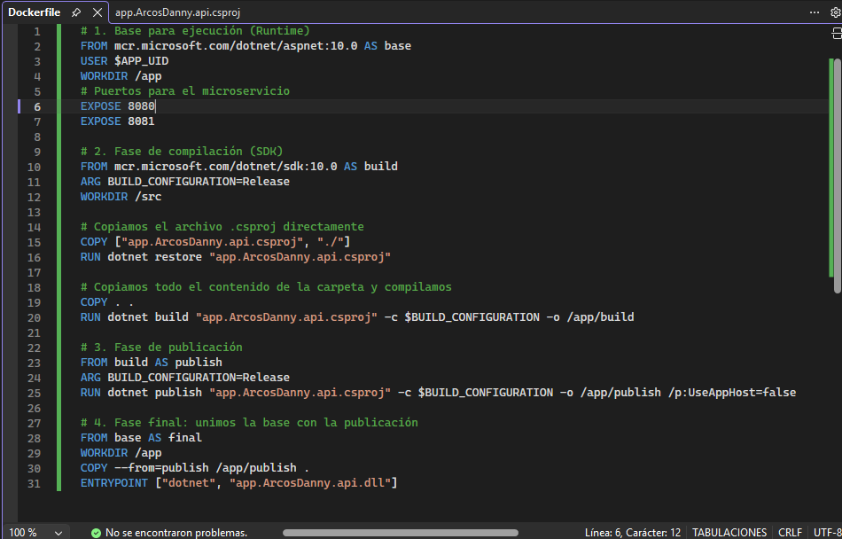
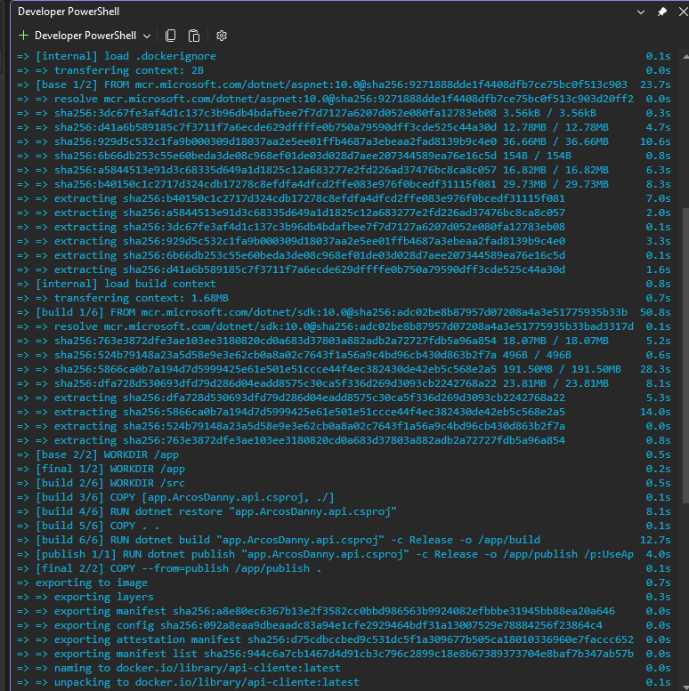
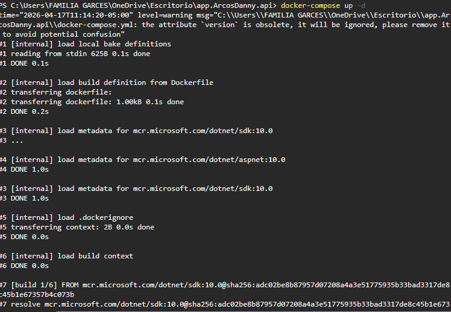
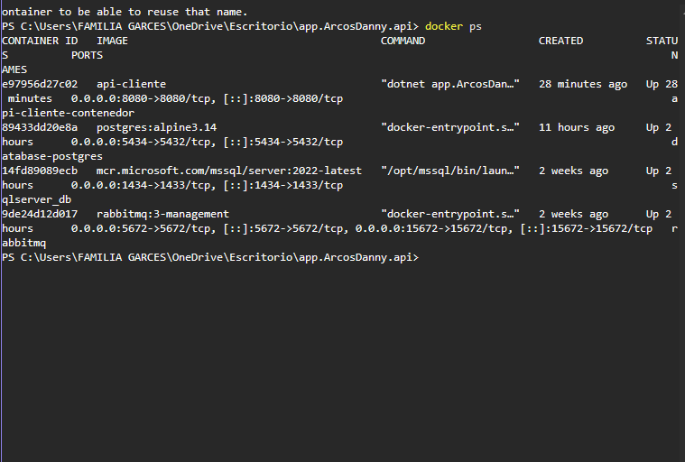
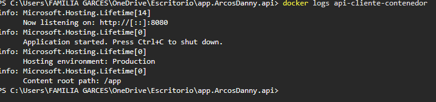

# Dockerización de Microservicios
**Estudiante:** Angela Arcos
**Institución:** Instituto Superior Tecnológico Universitario Japón

---

## 1. Introducción
Docker es una plataforma de software que permite la creación, el despliegue y la gestión de aplicaciones mediante contenedores. Estos contenedores empaquetan el código, las librerías y las dependencias necesarias, garantizando que la aplicación se ejecute de manera consistente en cualquier entorno. En esta práctica, se ha dockerizado una arquitectura de microservicios para optimizar su distribución y escalabilidad.

## 2. Microservicios dockerizados
El ecosistema implementado cuenta con los siguientes servicios:
* **API de Clientes:** Desarrollada en **.NET 10.0**.
* **Base de Datos Relacional:** Motor **PostgreSQL** (Puerto 5434).
* **Servidor de Mensajería:** **RabbitMQ** para la comunicación asíncrona.
* **Base de Datos NoSQL:** **SQL Server** (contenedor adicional para persistencia).

## 3. Dockerfile por servicio
Se diseñó un archivo `Dockerfile` optimizado para el microservicio principal, utilizando un esquema de construcción multi-etapa para reducir el peso de la imagen final.

### 📸 Evidencia de Configuración (Dockerfile)

*Configuración de las fases base, build, publish y final para el microservicio.*

## 4. Ejecución de contenedores
Para la puesta en marcha, se utilizó la orquestación mediante Docker Compose, permitiendo levantar toda la infraestructura con un solo comando.

### 🚀 Comandos utilizados:
* `docker build -t api-cliente .` (Construcción de la imagen).
* `docker-compose up -d` (Levantamiento orquestado de servicios).
* `docker ps` (Verificación de estado).

## 5. Evidencias de Funcionamiento

### A. Proceso de Build de Imágenes
Evidencia del despliegue y construcción de las capas de la imagen de .NET.

### B. Orquestación con Docker Compose
Captura del proceso automático de levantamiento de los múltiples servicios del proyecto.

### C. Servicios Activos (docker ps)
Validación final donde se observa el microservicio, PostgreSQL y RabbitMQ en ejecución simultánea.

### D. Pruebas de Funcionamiento Local
Comparativa de la ejecución del microservicio directamente en el entorno de desarrollo.

## 6. Configuración de Red y Puertos
* **API .NET:** Puerto interno 8080 / 8081.
* **PostgreSQL:** Puerto 5434 (Host) -> 5432 (Contenedor).
* **RabbitMQ:** Gestión en el puerto 15672.

## 7. Conclusión
La implementación exitosa de este proyecto demuestra las ventajas competitivas de Docker en el desarrollo moderno. Se logró centralizar la infraestructura, facilitar la comunicación entre servicios heterogéneos y asegurar un despliegue limpio y reproducible, habilidades críticas para la arquitectura de aplicaciones distribuidas.
